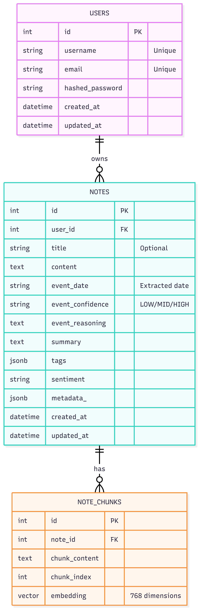

# MnemoAI Backend Documentation

Welcome to the MnemoAI Backend. This project is built with FastAPI and follows a strictly layered architecture to ensure scalability, security (CSRF/Auth), and AI integration.

---

## Architecture Overview
The backend is organized into functional layers, each with a single responsibility:

| Layer | Path | Responsibility |
| :--- | :--- | :--- |
| **Routes (Controllers)** | `app/api/routes/` | HTTP entry points: input validation, dependencies, and response mapping. |
| **Services** | `app/services/` | Business logic: AI orchestration, complex state, and SSE streaming logic. |
| **Repositories** | `app/repositories/` | Data access: SQL queries (PostgreSQL/SQLAlchemy) and Semantic search (Vector Store). |
| **Schemas** | `app/schemas/` | Pydantic models: Request/Response data validation and serialization. |
| **Models** | `app/models/` | Database entities: SQLAlchemy Declarative models. |
| **AI/Chains** | `app/ai/` | LLM logic: Prompts, chains, and embedding configurations. |

---

## Layer Standards

### 1. Routes (Controllers)
Routes should be thin. Their primary role is to coordinate between the HTTP request and the Service layer.

*   **Function Naming**: Use the `_endpoint` suffix (e.g., `create_note_endpoint`).
*   **Dependency Injection**: Always use `Depends()` for DB sessions (`get_db`) and authentication (`get_current_user`).
*   **Return Types**: Always define `response_model` or `StreamingResponse`. Use explicit `status_code` for non-200 responses.
*   **Error Handling**: Stop request execution by raising `HTTPException`.

### 2. Service Layer
Services contain the logic of the application. They are agnostic of the HTTP protocol.

*   **Async Generators**: Use `AsyncGenerator` for AI streaming (SSE). Standard format: `yield "data: {json_content}\n\n"`.
*   **Business Logic**: If logic involves more than just a simple DB query (e.g., calling AI after a save), it belongs here.
*   **Decoupling**: Services should return Pydantic schemas (using `.model_validate()`) rather than raw DB models to ensure the Route layer can't trigger accidental DB queries.

### 3. Repository Layer
Repositories handle the physical storage logic.

*   **Transactional Integrity**: Always wrap writes in `try/except` with `await session.rollback()` on failure.
*   **Vector Store**: Keep semantic search logic (vector distances, chunking) isolated from standard SQL logic.
*   **Encapsulation**: Routes and Services should not write raw SQLAlchemy queries; they should call repository functions.

### 4. Data Models (Schemas & Models)
*   **Schemas**: Use Pydantic v2. Prefix models logically (e.g., `NoteCreate`, `NoteUpdate`, `NoteResponse`).
*   **Models**: Use SQLAlchemy async-compatible models. Use a central `Base` model and ensure all tables use appropriate indexes.

---

## Database ERD (Entity Relationship Diagram)

MnemoAI uses a relational PostgreSQL database with `pgvector` extension for semantic search capabilities.

### Table Details

#### 1. Users (`users`)
Stores core user identity. Authenticated via JWT and protected by CSRF.

#### 2. Notes (`notes`)
The central entity for user content.
- **event_date**: AI-extracted date from the note content for timeline sorting.
- **tags/summary/sentiment**: Post-processed AI analysis metadata.
- **metadata_**: Flexible storage for additional AI-generated context.

#### 3. Note Chunks (`note_chunks`)
Stores fragmented note content for RAG (Retrieval-Augmented Generation).
- **embedding**: 768-dimensional vector representation of the chunk content.
- **indexed**: Uses HNSW (Hierarchical Navigable Small World) index for high-performance semantic search.

---

## Security Standards

### Double Submit Cookie CSRF
The backend enforces a strict "Option A" Double Submit Cookie pattern:
*   The server sets a `fastapi-csrf-token` cookie (JS-readable).
*   The frontend must send an `X-CSRF-Token` header that matches the cookie value.
*   Validation happens manually in sensitive routes to ensure transparency and custom error handling (401 vs 422).

### Authentication
*   JWT-based authentication via HttpOnly refresh tokens and memory-stored access tokens.
*   Access tokens are validated via the `get_current_user` dependency.

---

## Development Guidelines
*   **Environment**: Manage secrets in `.env`. Never commit this file.
*   **Migrations**: Use alembic for all database schema changes.
*   **Type Hinting**: Maintain 100% type hinting for all function signatures.
*   **Code Style**: Use ruff for linting and formatting.
